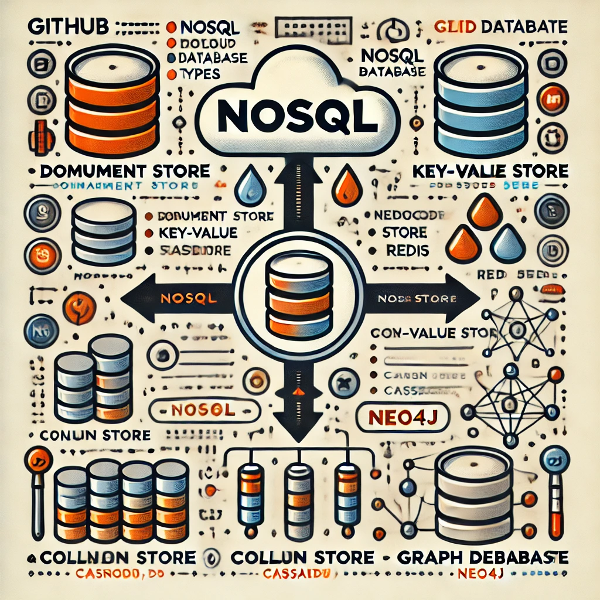

## _RESTFul API - MongoDB_ <br />
NoSQL databases represent a new challenge when compared with relational databases.
Here is how I faced the challenge creating an API based on a document database.

## _Table of contents_

- [_Overview_](#overview)
- [_Requirements_](#requirements)
- [_Project Structure_](#requirements)
- [_Howto Build and Run_](#requirements)
- [_Screenshot_](#screenshot)
- [_Links_](...)
- [_Built with_](#built-with)
- [_Code Snippet_](#requirements)
- [_Continued development_](#continued-development)
- [_Useful resources_](#useful-resources)
- [_Author_](#requirements)
- [_Portfolio_](#requirements)

## _Overview_

This API has a bunch of endpoints to return Posts and Comments associated to a User.
<br />

## _Features_

The app has been coded using Java 21, Spring Boot 3.4.2, Maven, Javadoc, Spring MongoDB, Spring JPA,
Docker.
<br /

## _Project Structure_
- docs
   - javadocs
- src
    - main
    - java
        - br.dev.ferreiras.mongodb
            - config
            - controller
              - handlers 
            - dto
            - model
              - entities
              - dto
              - embedded
            - mapper
            - repository
            - services
              - exceptions
    - resources
        - application-test.properties
        - application-properties
    - test
-

## _Howto Build and Run_

  ```
  - MongoDB Database : http://127.0.0.1:27017
  - profile active: test
  - service socket: 127.0.0.1:8080
  - tweak a few knobs to get it up and running
   ```

## _Screenshot_

[]()

## _Links_

- Live Site URL: <a href="https://api.ferreiras.dev.br/swagger-ui/index.html" target="_blank">API MongoDB</a>

## _Built with_

[](https://skillicons.dev)

## _Code Snippet_

```java

/**
 * 
 * @author ricardo@ferreiras.dev.br
 * @version 1.1.030901
 * @since 1.0
 *
 */
@Repository
public interface PostRepository extends MongoRepository<Post, String> {


  @Query("""   
      {
      'title': { $regex: ?0, $options: 'i' }
      }
      """)
  List<Post> searchByTitle(String text);

  @Query(
      """
          {
            $and: [
              { 'moment': { $gte: ?1 } }, { 'moment': { $lte: ?2 } }, {
                $or: [
                  {'title': { $regex: ?0, $options: 'i' } },
                  {'body':  { $regex: ?0, $options: 'i' } },
                  {'comments.text': { $regex: ?0, $options: 'i' } }
                ]
              }
            ]
          }
          """)
  List<Post> fullSearch(String text, Instant startMoment, Instant endMoment);

  List<Post> findByTitleContainingIgnoreCase(String text);
}

``` 

## _Continued development_

- Unit Tests 

### _Useful resources_

- [https://spring.io] Awesome Java framework!.
- [https://start.spring.io/]  Handy startup tool.
- [https://mvnrepository.com] Tools that help tackle the beast
- [https://docs.spring.io/spring-data/mongodb/reference/]  MongoDB reference doc

## _Author_
<a href="mailto:ricardo@ferreiras.dev.br">Ricardo Ferreira</a>

## - _Portfolio_
<a href="https://www.ferreiras.dev.br" target="_blank">My Portfolio...</a>

